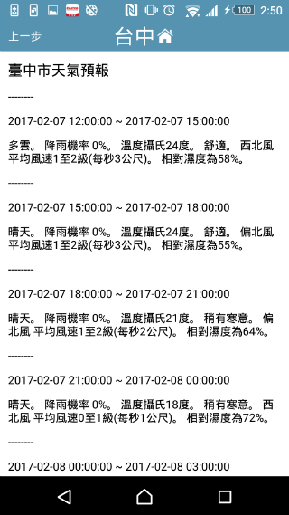

## 說明

單純用 span 顯示頁面。

## 範例圖片

## Third party Server 回應格式

	HTTP/1.1 200 
	Content-Type: application/json;charset=UTF-8
	X-Transfer-Encoding: chunked
	Date: Mon, 20 Feb 2017 10:07:49 GMT
	Content-length: 3101

	{
	  "rcode": "200",
	  "rdesc": "ok",
	  "pagename": "taichung",
	  "returnpage": "home",
	  "canforward": true,
	  "size": 18,
	  "body": [
	    {
	      "type": "span",
	      "value": "臺中市天氣預報",
	      "size": 18
	    },
	    {
	      "type": "span",
	      "value": "--------",
	      "size": 0
	    },
	    {
	      "type": "span",
	      "value": "2017-02-20 18:00:00 ~ 2017-02-20 21:00:00",
	      "size": 0
	    },
	    {
	      "type": "span",
	      "value": "多雲。 降雨機率 20%。 溫度攝氏24度。 舒適。 東北風 平均風速0至1級(每秒1公尺)。 相對濕度為66%。",
	      "size": 0
	    },
	    {
	      "type": "span",
	      "value": "--------",
	      "size": 0
	    },
	    {
	      "type": "span",
	      "value": "2017-02-20 21:00:00 ~ 2017-02-21 00:00:00",
	      "size": 0
	    },
	    {
	      "type": "span",
	      "value": "多雲。 降雨機率 20%。 溫度攝氏22度。 舒適。 偏北風 平均風速0至1級(每秒1公尺)。 相對濕度為74%。",
	      "size": 0
	    },
	    {
	      "type": "span",
	      "value": "--------",
	      "size": 0
	    }
	  ]
	}