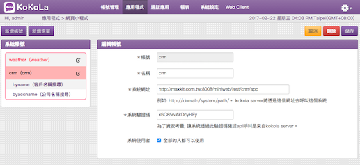
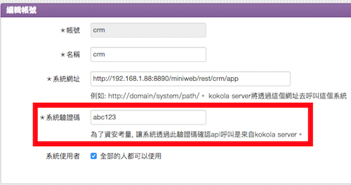

# 前言:
這是一個用 Java 寫的範例專案 (Project)，用來示範第三方的應用程式如何介接 KoKoLa 應用程式。

注意，此範例專案為 Web Service，且沒有任何的身份驗證機制，因此不建議放到 Internet 上運行。

# 整合概念:
整合架構概念圖：

此範例整合專案架構：

此範例為 miniweb 專案，也就是屬於 Adapter 的這層。

# 範例 Project：

[Github - maxkit/miniweb](https://github.com/maxkitapp/miniweb)

# Project 組成:
* Maven Project。
* Web Service framework: Spring Web MVC。

專案與 Spring Web MVC 相關設定請參考：[Maxkit Blog：Spring MVC with Maven](http://blog.maxkit.com.tw/2017/02/spring-mvc-with-maven-web-service.html)

# Package 結構:

package 名稱為 **tw.com.maxkit.miniweb**，package 底下會有幾個主要目錄，截圖與說明如下：

* bean：存放 data bean 的目錄。
* business：業務邏輯相關類別放置處。
* common：controller 與 business 共用的類別會放這。
* controller：rest api 入口。
* utils：工具類別會放這。

# Application Overview：

miniweb 專案內有兩個與 KoKoLa Application 介接的服務，分別為

* 天氣小程式(weather)
	* home(span)，首頁，顯示圖片與小程式說明文字。
		* satellite(image)，衛星雲圖。
		* taichung(span)，台中天氣，會去跟 Third Party Application 要資料。
		* kaohsiung(span)，高雄天氣，會去跟 Third Party Application 要資料。
		* taipei(span)，台北天氣，會去跟 Third Party Application 要資料。
		* listEntertainment(option)，育樂天氣。
			* queryEntertainment(webview)，查詢中央氣象局相關育樂天氣 webview。
		* helper(option)，元件展示。
			* helperdetail，元件展示。
* CRM 小程式(crm)：
	* home(span)，首頁，顯示圖片與小程式說明文字。
		* byname(text)，根據姓名搜尋的文字輸入框。
			* searchbyname(option)，姓名搜尋結果，會去跟 Third Party Application 要資料
				* getbyid\_name(span)，人員詳細資訊，會去跟 Third Party Application 要資料
		* byaccname(text)，根據公司名稱搜尋的文字輸入框。
			* searchbyaccname(option)，公司名稱搜尋結果，會去跟 Third Party Application 要資料
				* getbyid\_accname(span)，人員詳細資訊，會去跟 Third Party Application 要資料

# 範例：實作 CRM 應用，根據姓名搜尋客戶：

1. 到 KoKoLa Web Admin 設定，包括 url、名稱。 

	

2. 開始構想頁面的使用流程，比如說 CRM 應用系統介接。
	1. (home) 點網頁小程式後預設進去之後會是先顯示首頁。**注意，此頁面一定要實作。**。
	2. (byname) 首頁點了某個 icon 後，進入到下個頁面要求使用者輸入客戶姓名。
	3. (searchbyname) 輸入完姓名後到下一頁會把搜尋到相關客戶顯示出來讓使用者點選想看詳細資訊的客戶為何。
	4. (getbyid\_name) 最後使用者點擊了某位客戶後在透過客戶 id 回傳該客戶詳細資訊。

	所以整個頁面轉換的流程如下：

	home -> byname -> searchbyname -> getbyid\_name
	
3. 接著開始實作 Web Service Project，Web Service 要能處理在 KoKoLa Web Admin 內設定的 URL，比如說你設定 URL 為：

		https://192.168.1.88:8443/miniweb/weather/app
		
	當 KoKoLa 需要呼叫你實作的 Web Service 時，它會以 HTTP POST 的方式呼叫此 URL。
	
4. 再來換實作 Web Service，KoKoLa 發送給 Web Service 的請求會透過 HTTP POST 發送，BODY 為 JSON 格式。Web Service 必須回應 KoKoLa，回應的 BODY 格式為 JSON。下列範例為顯示 CRM home 頁面的請求與回應：

	KoKoLa 發送請求給 Web Service (本文件的請求與回應的範例都會附上 HTTP header)：

		POST http://192.168.1.88:8080/miniweb/weather/app HTTP/1.1
		Host: 192.168.1.88:8080
		Proxy-Connection: keep-alive
		Content-length: 102
		Postman-Token: 9c9e5638-f211-4451-f5c3-d907ebdafbbc
		Cache-Control: no-cache
		Origin: chrome-extension://fhbjgbiflinjbdggehcddcbncdddomop
		User-Agent: Mozilla/5.0 (Macintosh; Intel Mac OS X 10_11_6) AppleWebKit/537.36 (KHTML, like Gecko) Chrome/56.0.2924.87 Safari/537.36
		Content-Type: application/json
		Accept: */*
		Accept-Encoding: gzip, deflate
		Accept-Language: zh-TW,zh;q=0.8,en-US;q=0.6,en;q=0.4
		
		{
		    "userid": "mayer",
		    "exectoken" : "abc123",
		    "pagename" : "home",
		    "sessionid" : ""
		}
		
	Web Service 回應 KoKoLa:
	
		HTTP/1.1 200 OK
		Server: Apache-Coyote/1.1
		Content-Type: application/json;charset=UTF-8
		X-Transfer-Encoding: chunked
		Date: Tue, 14 Feb 2017 06:52:13 GMT
		Content-length: 104
		
		{"rcode":"200","rdesc":"ok","pagename":"home","body":[{"type":"span","value":"Welcome to Weather App"}]}
		
5. home 頁面實作

	範例圖片：
	
	

	Request：
	
		POST https://localhost:8443/miniweb/rest/crm/app HTTP/1.1
		Host: localhost:8443
		Connection: keep-alive
		Content-length: 102
		Postman-Token: 3c74fbb4-4999-1bb9-ab87-b9b672fcf186
		Cache-Control: no-cache
		Origin: chrome-extension://fhbjgbiflinjbdggehcddcbncdddomop
		User-Agent: Mozilla/5.0 (Macintosh; Intel Mac OS X 10_11_6) AppleWebKit/537.36 (KHTML, like Gecko) Chrome/56.0.2924.87 Safari/537.36
		Content-Type: application/json
		Accept: */*
		Accept-Encoding: gzip, deflate, br
		Accept-Language: zh-TW,zh;q=0.8,en-US;q=0.6,en;q=0.4
		
		{
		    "userid": "mayer",
		    "exectoken" : "abc123",
		    "pagename" : "home",
		    "sessionid" : ""
		}
	
	Response，需注意首頁有圖片，圖片需要轉成 Base64 文字編碼才能正常顯示：
		
		HTTP/1.1 200 OK
		Content-Type: application/json;charset=UTF-8
		X-Transfer-Encoding: chunked
		Date: Tue, 21 Feb 2017 05:01:58 GMT
		Server: 
		Content-length: 69655
		
		{
		  "rcode": "200",
		  "rdesc": "ok",
		  "pagename": "home",
		  "sessionid": "",
		  "canforward": false,
		  "size": 18,
		  "body": [
		    {
		      "type": "img",
		      "size": 0,
		      "imgid": "homepic"
		    },
		    {
		      "type": "span",
		      "value": "透過 CRM 小程式，可以使用客戶姓名或公司名稱搜尋相關客戶資訊。",
		      "size": 0
		    }
		  ],
		  "imgbody": [
		    {
		      "imgid": "homepic",
		      "imgdata": "iVBORw0KGgoAAAANSUhEUgAABQ......
		    }
		  ]
		}
	
6. byname 頁面實作

	範例圖片：
	
	

	Request：
	
		POST https://192.168.1.88:8443/miniweb/crm/app HTTP/1.1
		Host: 192.168.1.88:8443
		Connection: keep-alive
		Content-length: 104
		Postman-Token: 0bb4354f-5c07-c47f-3da0-2297fb17dbe5
		Cache-Control: no-cache
		Origin: chrome-extension://fhbjgbiflinjbdggehcddcbncdddomop
		User-Agent: Mozilla/5.0 (Macintosh; Intel Mac OS X 10_11_6) AppleWebKit/537.36 (KHTML, like Gecko) Chrome/56.0.2924.87 Safari/537.36
		Content-Type: application/json
		Accept: */*
		Accept-Encoding: gzip, deflate, br
		Accept-Language: zh-TW,zh;q=0.8,en-US;q=0.6,en;q=0.4
		
		{
		    "userid": "mayer",
		    "exectoken" : "abc123",
		    "pagename" : "byname",
		    "sessionid" : ""
		}
		
	Response：
	
		HTTP/1.1 200 OK
		Server: Apache-Coyote/1.1
		Content-Type: application/json;charset=UTF-8
		X-Transfer-Encoding: chunked
		Date: Fri, 17 Feb 2017 08:40:34 GMT
		Content-length: 229
		
		{
		  "rcode": "200",
		  "rdesc": "ok",
		  "pagename": "byname",
		  "sessionid": "608504fa-0fe7-4461-85dc-05e0b0207729",
		  "returnpage": "home",
		  "action": "searchbyname",
		  "body": [
		    {
		      "type": "text",
		      "id": "name",
		      "value": "請輸入人員名稱",
		      "keyboard": "any"
		    }
		  ]
		}
		
7. searchbyname 頁面實作

	範例圖片：
	
	

	Request：

		POST https://192.168.1.88:8443/miniweb/crm/app HTTP/1.1
		Host: 192.168.1.88:8443
		Connection: keep-alive
		Content-length: 207
		Postman-Token: 6a7fe1ec-e006-2b8b-f5c4-3fe74baede7b
		Cache-Control: no-cache
		Origin: chrome-extension://fhbjgbiflinjbdggehcddcbncdddomop
		User-Agent: Mozilla/5.0 (Macintosh; Intel Mac OS X 10_11_6) AppleWebKit/537.36 (KHTML, like Gecko) Chrome/56.0.2924.87 Safari/537.36
		Content-Type: application/json
		Accept: */*
		Accept-Encoding: gzip, deflate, br
		Accept-Language: zh-TW,zh;q=0.8,en-US;q=0.6,en;q=0.4
		
		{
		    "userid": "mayer",
		    "exectoken" : "abc123",
		    "pagename" : "searchbyname",
		    "sessionid": "b2032c5d-69aa-4365-b080-c1e965416eb5",
		    "postdata" : [
		    	{"id": "name", "value": "莊"}
		    ]
		}
		
	Response：
	
		HTTP/1.1 200 OK
		Server: Apache-Coyote/1.1
		Content-Type: application/json;charset=UTF-8
		X-Transfer-Encoding: chunked
		Date: Fri, 17 Feb 2017 08:51:22 GMT
		Content-length: 521
		
		{
		  "rcode": "200",
		  "rdesc": "ok",
		  "pagename": "searchbyname",
		  "sessionid": "b2032c5d-69aa-4365-b080-c1e965416eb5",
		  "returnpage": "byaccname",
		  "action": "getbyid_name",
		  "body": [
		    {
		      "type": "option",
		      "id": "cid",
		      "value": "搜尋關鍵字：莊；搜尋結果：2 筆",
		      "optionlist": [
		        {
		          "optname": "莊XX (XX科技股份有限公司)",
		          "optvalue": "72a2fb24-1111-2222-3333-510b27867ca6",
		          "optimgid": null
		        },
		        {
		          "optname": "莊OO (OO資訊)",
		          "optvalue": "3789b5ec-1111-2222-3333-517501c193bb",
		          "optimgid": null
		        }
		      ],
		      "size": "18"
		    }
		  ]
		}

8. getbyid\_name 頁面實作

	範例圖片：
	
	

	Request：
	
		POST https://192.168.1.88:8443/miniweb/crm/app HTTP/1.1
		Host: 192.168.1.88:8443
		Connection: keep-alive
		Content-length: 204
		Postman-Token: d234c14b-f782-b3b9-ce2f-efaf94df5e79
		Cache-Control: no-cache
		Origin: chrome-extension://fhbjgbiflinjbdggehcddcbncdddomop
		User-Agent: Mozilla/5.0 (Macintosh; Intel Mac OS X 10_11_6) AppleWebKit/537.36 (KHTML, like Gecko) Chrome/56.0.2924.87 Safari/537.36
		Content-Type: application/json
		Accept: */*
		Accept-Encoding: gzip, deflate, br
		Accept-Language: zh-TW,zh;q=0.8,en-US;q=0.6,en;q=0.4
		
		{
		    "userid": "mayer",
		    "exectoken" : "abc123",
		    "pagename" : "getbyid_name",
		    "sessionid" : "",
		    "postdata" : [
		    	{"id": "cid", "value": "3789b5ec-d3fa-3398-7b86-517501c193bb"}
		    ]
		}

	Response：
	
		HTTP/1.1 200 OK
		Server: Apache-Coyote/1.1
		Content-Type: application/json;charset=UTF-8
		X-Transfer-Encoding: chunked
		Date: Fri, 17 Feb 2017 08:54:50 GMT
		Content-length: 430
		
		{
		  "rcode": "200",
		  "rdesc": "ok",
		  "pagename": "getbyid_name",
		  "sessionid": "",
		  "returnpage": "searchbyname",
		  "body": [
		    {
		      "type": "span",
		      "value": "姓名：莊OO"
		    },
		    {
		      "type": "span",
		      "value": "公司：OO資訊"
		    },
		    {
		      "type": "span",
		      "value": "職稱：副總經理"
		    },
		    {
		      "type": "span",
		      "value": "手機：0912-345678"
		    },
		    {
		      "type": "span",
		      "value": "公司電話：04-2222-3333"
		    },
		    {
		      "type": "span",
		      "value": "地址：台中市中區台灣大道一段1號"
		    }
		  ]
		}

# Session 說明：

KoKoLa miniweb API 提供 Session 機制，當 response 有回傳 sessionid 時，之後 Client 的每一個 request 都會帶入此 sessionid，這樣可以讓 Web Server 知道這是屬於同一系列的操作。

# Session 實作範例：

比如說在上面例子，流程為：

* 客戶資料查詢(crm)：
	* home(span)，首頁。
		* byname(text)，根據姓名搜尋的文字輸入框。
			* searchbyname(option)，姓名搜尋結果，會去跟 Third Party Application 要資料
				* getbyid\_name(span)，人員詳細資訊，會去跟 Third Party Application 要資料

首先在點進 byname 頁面時會顯示輸入框，要求使用者輸入搜尋姓名，接著在進到 searchbyname 頁面時，會把使用者在 byname 輸入框輸入的文字一併帶入，然後把搜尋結果顯示在 searchbyname 頁面上。之後使用者點擊某位客戶，在帶到 getbyid\_name 頁面顯示客戶詳細資料。當客戶要從 getbyid\_name 回到 searchbyname 頁面時，會不知道之前帶入的文字為何，此時就要可以用 session 機制來處理。

在進入 byname 頁面時，Web Service 產生一組 sessionid 並回應給 Client，接著在 Client 在輸入文字後要進入到 searchbyname 時，Web Service 透過 sessionid 把 Client 輸入的文字記錄下來。這樣一來若是 Client 之後有些到 searchbyname 頁面但是沒有帶輸入參數時，Third Party Application 可以透過 sessionid 來檢查是否是先前已經操作過了，若有輸入記錄則可以自動幫 Client 帶入輸入參數。

實作範例如下，在進入 byname 頁面時，進行 initSession，在進入 searchbyname 頁面時，將輸入參數進行 session 判斷與處理後，在繼續接下來的流程：

	switch (pagename) {
		case "home":
			apiOut = homeHandler(apiIn, apiOut);
			break;
		case "byname":
			sessionid = sessionManager.initSession(userid);
			apiOut = bynameHandler(apiIn, apiOut);
			break;
		case "searchbyname":
			apiIn = sessionManager.sessionHandler(apiIn);
			apiOut = searchbynameHandler(apiIn, apiOut);
			break;
		case "getbyid_name":
			apiOut = getbyidHandler(apiIn, apiOut);
			break;
			
# Web Server 請求驗證

在新增系統帳號時，可以設定系統驗證碼，如下：

之後在 KoKoLa Server 發送請求給 Web Service 時，會在 POST body 的 JSON 內帶上參數 exectoken，此參數即為系統驗證碼：

	POST http://192.168.1.88:8080/miniweb/weather/app HTTP/1.1
	Host: 192.168.1.88:8080
	Proxy-Connection: keep-alive
	Content-length: 102
	Postman-Token: 9c9e5638-f211-4451-f5c3-d907ebdafbbc
	Cache-Control: no-cache
	Origin: chrome-extension://fhbjgbiflinjbdggehcddcbncdddomop
	User-Agent: Mozilla/5.0 (Macintosh; Intel Mac OS X 10_11_6) AppleWebKit/537.36 (KHTML, like Gecko) Chrome/56.0.2924.87 Safari/537.36
	Content-Type: application/json
	Accept: */*
	Accept-Encoding: gzip, deflate
	Accept-Language: zh-TW,zh;q=0.8,en-US;q=0.6,en;q=0.4
	
	{
	    "userid": "mayer",
	    "exectoken" : "abc123",
	    "pagename" : "home",
	    "sessionid" : ""
	}
	
若是 exectoken 參數與預期不同，則代表傳入的驗證碼錯誤，Web Service 不應該繼續與此請求互動，需回應以下訊息：

	HTTP/1.1 200 OK
	Server: Apache-Coyote/1.1
	Content-Type: application/json;charset=UTF-8
	X-Transfer-Encoding: chunked
	Date: Tue, 14 Feb 2017 06:52:13 GMT
	Content-length: 104
		
	{
	  "rcode": "403",
	  "rdesc": "Forbidden"
	}