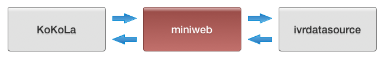
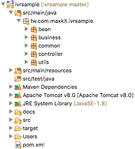

[Git  ivrsample](https://github.com/maxkitapp/ivrsample)
# 前言:
這是一個用 Java 寫的範例專案 (Project)，用來示範第三方的應用程式如何介接 KoKoLa 應用程式。

注意，此範例專案為 Web Service，且沒有任何的身份驗證機制，因此不建議放到 Internet 上運行。

# 整合概念:
整合架構概念圖：

此範例整合專案架構：

此範例為 ivrsample 專案，也就是屬於 Adapter 的這層。

# Project 組成:
* Maven Project。專案建立過程請參考 [Maxkit Blog：Spring MVC with Maven](http://blog.maxkit.com.tw/2017/02/spring-mvc-with-maven-web-service.html)
* Web Service framework: Spring Web MVC。

# Package 結構:

package 名稱為 **tw.com.maxkit.miniweb**，package 底下會有幾個主要目錄，截圖與說明如下：

* bean：存放 data bean 的目錄。
* business：業務邏輯相關類別放置處。
* common：controller 與 business 共用的類別會放這。
* controller：rest api 入口。
* utils：工具類別會放這。

# Application Overview：

ivrsample 專案有兩個與 KoKoLa Application 介接的服務，分別為

* 天氣相關查詢(weather)
* 客戶資料查詢(crm)：

		weather:
			home(span)
				satellite(image)
				taichung(span)，會去跟 Third Party Application 要資料
				kaohsiung(span)，會去跟 Third Party Application 要資料
				taipei(span)，會去跟 Third Party Application 要資料
				listEntertainment(option)
					queryEntertainment(webview)
		crm
			home(span)
				byname(text)
					searchbyname(option)，會去跟 Third Party Application 要資料
						getbyid_name(span)，會去跟 Third Party Application 要資料
				byaccname(text)
					searchbyaccname(option)，會去跟 Third Party Application 要資料
						getbyid_accname(span)，會去跟 Third Party Application 要資料					

# 範例：實作 CRM 應用，根據姓名搜尋客戶：

1. 到 KoKoLa Web Admin 設定，包括 url、名稱。
2. 開啟 KoKoLa App 確認設定成功。
3. 開始構想頁面的使用流程，比如說 CRM 應用系統介接。
	1. (home) 點進去之後會是先顯示首頁。
	2. (byname) 首頁點了某個 icon 後，進入到下個頁面要求使用者輸入客戶姓名。
	3. (searchbyname) 輸入完姓名後到下一頁會把搜尋到相關客戶顯示出來讓使用者點選想看詳細資訊的客戶為何。
	4. (getbyid\_name) 最後使用者點擊了某位客戶後在透過客戶 id 回傳該客戶詳細資訊。

	所以整個頁面轉換的流程如下：

	home -> byname -> searchbyname -> getbyid_name
	
5. 接著開始實作 Web Service Project，Web Service 要能處理在 KoKoLa Web Admin 內設定的 URL，比如說你設定 URL 為：

		http://192.168.1.88:8080/ivrsample/weather/app
		
	當 KoKoLa 需要呼叫你實作的 Web Service 時，它會以 HTTP POST 的方式呼叫此 URL。
	
4. 接著開始實作 Web Service，KoKoLa 發送給 Web Service 的請求會透過 HTTP POST 發送，BODY 為 JSON 格式。Web Service 必須回應 KoKoLa，回應的 BODY 格式為 JSON。下列範例為顯示 CRM home 頁面的請求與回應：

	KoKoLa send request to Web Service：

		POST http://192.168.1.88:8080/ivrsample/weather/app HTTP/1.1
		Host: 192.168.1.88:8080
		Proxy-Connection: keep-alive
		Content-length: 102
		Postman-Token: 9c9e5638-f211-4451-f5c3-d907ebdafbbc
		Cache-Control: no-cache
		Origin: chrome-extension://fhbjgbiflinjbdggehcddcbncdddomop
		User-Agent: Mozilla/5.0 (Macintosh; Intel Mac OS X 10_11_6) AppleWebKit/537.36 (KHTML, like Gecko) Chrome/56.0.2924.87 Safari/537.36
		Content-Type: application/json
		Accept: */*
		Accept-Encoding: gzip, deflate
		Accept-Language: zh-TW,zh;q=0.8,en-US;q=0.6,en;q=0.4
		
		{
		    "userid": "mayer",
		    "appuseruuid": "foo-bar",
		    "pagename" : "home",
		    "sessionid" : ""
		}
		
	Web Service response KoKoLa:
	
		HTTP/1.1 200 OK
		Server: Apache-Coyote/1.1
		Content-Type: application/json;charset=UTF-8
		X-Transfer-Encoding: chunked
		Date: Tue, 14 Feb 2017 06:52:13 GMT
		Content-length: 104
		
		{"rcode":"200","rdesc":"ok","pagename":"home","body":[{"type":"span","value":"Welcome to Weather App"}]}
		
		
# Session：

	singleton
	crm only
		initSession
			byname
			byaccname
		sessionHandler
			searchbyname
			searchbyaccname
	for keep byname/byaccname input use，
	byname -> searchbyname -> getbyid_name -> searchbyname, input will lose, so need session to keep input data。